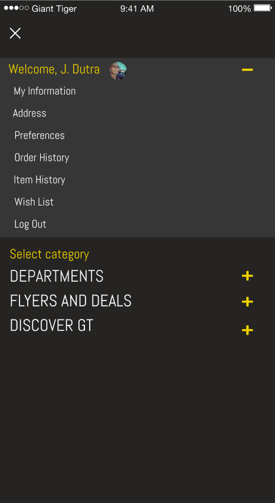
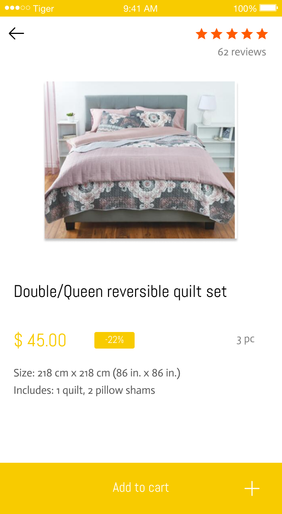

# 2019 -  a Clean Concept for Giant Tiger  Mobile Website

## Giant Tiger is a Canadian Retailer. This project was designed to be part of my application for a position as a Digital Retention Coordinator

### This project was designed using Figma and Gimp

### Design

- Figma
- Gimp

### Front-end

- (TODO)

---

## Live Demo

### https://www.figma.com/file/L18sSpkJkWF1t8K7vxJZkajB/Giant-Tiger_0.1?node-id=0%3A1

<iframe style="border: none;" width="800" height="450" src="https://www.figma.com/embed?embed_host=share&url=https%3A%2F%2Fwww.figma.com%2Fproto%2FL18sSpkJkWF1t8K7vxJZkajB%2FGiant-Tiger%3Fnode-id%3D8%253A32%26viewport%3D-317%252C21%252C0.065325%26scaling%3Dmin-zoom" allowfullscreen></iframe>
---

### Screenshots

---

### TODOS

- Design a email flyer
- Design a Desktop Website
